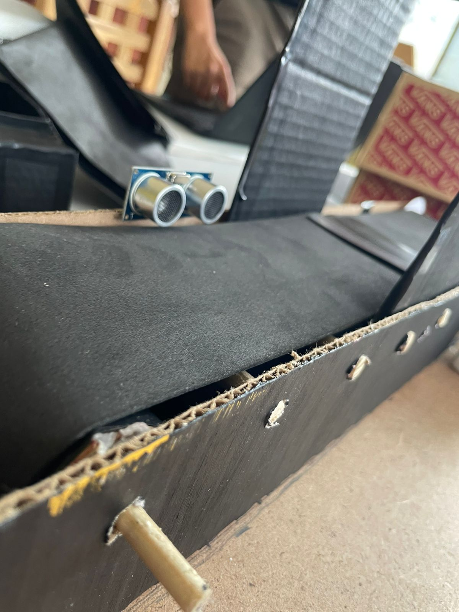
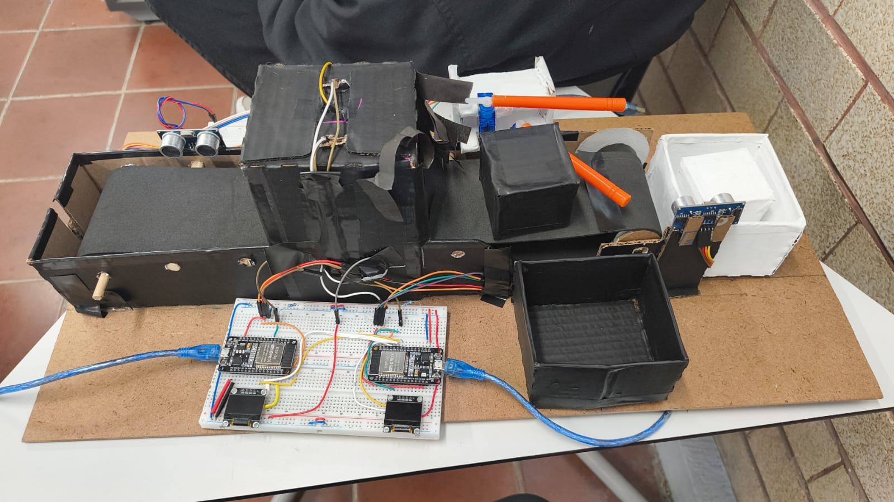

# 🤖 Sistema Distribuido de Clasificación Automática con ESP32

## 📌 Descripción

Este proyecto implementa un sistema distribuido de clasificación automática de objetos mediante una banda transportadora utilizando tres microcontroladores ESP32 bajo una arquitectura maestro-esclavo con redundancia y tolerancia a fallos.

El sistema es capaz de identificar cajas negras y blancas utilizando sensores LDR dentro de una cámara oscura, procesando localmente las lecturas analógicas y clasificando automáticamente los objetos mediante un servomotor.

Además, incorpora mecanismos de autodiagnóstico, detección de fallos, redundancia automática, monitoreo en tiempo real mediante página web y supervisión distribuida entre múltiples ESP32.

---

## 🎯 Objetivo

Desarrollar un sistema embebido distribuido capaz de clasificar automáticamente objetos de color negro y blanco mediante procesamiento analógico, control de actuadores y comunicación entre microcontroladores, integrando además mecanismos de redundancia y tolerancia a fallos.

---

## 🧠 Arquitectura del sistema

El sistema está conformado por tres microcontroladores ESP32:

| Módulo | Función |
|---|---|
| ESP1 | Nodo esclavo principal |
| ESP2 | Nodo esclavo redundante |
| ESP3 | Supervisor central |

### ESP1 y ESP2
- Lectura del sensor LDR
- Procesamiento ADC
- Clasificación de color
- Control del servomotor
- Pantalla OLED
- Detección de fallos

### ESP3
- Control de banda transportadora
- Lectura de sensores ultrasónicos
- Supervisión general
- Página web HTML
- Gestión de redundancia
- Monitoreo del sistema

---

## 🔧 Hardware utilizado

- ESP32-WROOM-32  
- Sensor LDR  
- Sensores ultrasónicos HC-SR04  
- Servomotor SG90  
- Motor a pasos 28BYJ-48  
- Driver ULN2003  
- Pantalla OLED SSD1306  
- LEDs blancos y rojos  
- Resistencias (47kΩ, 4.7kΩ, 2kΩ y 330Ω)  
- Protoboards  
- Cable AWG24  
- Cartón y fomi para estructura  

---

## 🔌 Configuración general de pines

#ESP3

| Elemento | GPIO | Dirección | Descripción |
|---|---|---|---|
| ULTRASONICO_1_TRIG | 33 | OUTPUT | Trigger HC-SR04 |
| ULTRASONICO_1_ECHO | 32 | INPUT | Echo HC-SR04 |
| ULTRASONICO_1_TRIG | 26 | OUTPUT | Trigger HC-SR04 |
| ULTRASONICO_1_ECHO | 25 | INPUT | Echo HC-SR04 |
| LED_LUZ | 21 | OUTPUT | Iluminación cámara |
| LED_ERROR | 23 | OUTPUT | Indicador de fallo |
| ULN1 | 17 | OUTPUT | Configuración motor |
| ULN2 | 5 | OUTPUT | Configuración motor |
| ULN3 | 18 | OUTPUT | Configuración motor |
| ULN4 | 19 | OUTPUT | Configuración motor |

#ESP1 y ESP2
| Elemento | GPIO | Dirección | Descripción |
|---|---|---|---|
| LDR_ADC | 34 | INPUT (ADC) | Lectura analógica LDR |
| SERVO | 32 | OUTPUT PWM | Control servomotor |
| OLED_SDA | 19 | I2C | Datos OLED |
| OLED_SCL | 18 | I2C | Reloj OLED |
| I2C_SDA | 21 | I2C | Comunicación ESP1-ESP2 |
| I2C_SCL | 22 | I2C | Comunicación ESP1-ESP2 |

> Los pines pueden variar dependiendo de la implementación final.

---

## ⚙️ Funcionamiento

1. La banda transportadora mueve una caja.
2. El sensor ultrasónico detecta la presencia del objeto.
3. El ESP3 inicia temporización.
4. La caja entra a la cámara oscura.
5. El ESP activo enciende el LED de iluminación.
6. El sensor LDR realiza la lectura ADC.
7. El ESP procesa localmente el valor obtenido.
8. Se determina si la caja es negra o blanca.
9. El servomotor desvía la caja automáticamente.
10. El ESP3 recibe el resultado y actualiza la página web.
11. Un sensor final verifica la correcta clasificación.

---

## 🎮 Modos de operación

### Modo normal
- Clasificación automática
- Procesamiento distribuido
- Monitoreo continuo

### Modo redundante
- ESP de respaldo en espera
- Conmutación automática ante fallos

### Modo monitoreo web
- Visualización en tiempo real
- Estado de ESP32
- Valores ADC
- Fallos detectados

---

## 📊 Variables monitoreadas

- Valores ADC
- Color detectado
- Estado de ESP1 y ESP2
- Estado del servomotor
- Fallos detectados
- Cantidad de cajas procesadas

---

## 🌐 Página web embebida

El ESP3 aloja una interfaz web HTML accesible mediante WiFi para supervisar el funcionamiento del sistema en tiempo real.

La interfaz permite visualizar:

- Estado operativo
- Clasificación actual
- Variables ADC
- Indicadores de error
- Estado de redundancia

---

## 📸 Imágenes

### Diagrama general


### Banda transportadora


### Sistema físico


---

## 📁 Estructura

```text
ProyectoFinal/
├── ESP1/
│   ├── main/
│   ├── components/
│   └── sdkconfig
│
├── ESP2/
│   ├── main/
│   ├── components/
│   └── sdkconfig
│
├── ESP3/
│   ├── main/
│   ├── web/
│   ├── components/
│   └── sdkconfig
│
├── imagenes/
├── README.md
```

---

## 🧪 Pruebas realizadas

- Lectura ADC del LDR
- Detección de cajas
- Clasificación automática
- Control del servomotor
- Movimiento de banda
- Comunicación I2C
- Comunicación WiFi
- Actualización web
- Pruebas de redundancia

---

## ⚠️ Limitaciones

- Sensibilidad a variaciones extremas de iluminación
- Precisión limitada del sensor LDR
- Dependencia de calibración experimental
- Velocidad limitada del prototipo físico

---

## 📚 Tecnologías utilizadas

- ESP-IDF
- FreeRTOS
- HTML
- WiFi
- I2C
- ADC
- PWM

---

## 📚 Historial de commits

- Se agrego la base del proyecto
- Configuración de servomotor - Prueba con botón.c
- Cambio de nombre de archivo a esp1.txt
- Cambio de nombre de archivo a esp1.txt
- Configuración de ADC y OLED.c
- Modificación para el motor paso a paso
- Secuencia de etapas y lecuta de los sensores
- Funciones de soporte y inicio de la comunicacion wifi
- Configuración de servomotor, ADC y OLED en Esclavo 2.c
- Cambio de nombre de archivo a esp2.txt
- Cambio de nombre de archivo a esp2.txt
- Comunicación I2C entre esclavo principal y secundario
- Agregado README.md
- Add files via upload
- Comunicación Wifi en esclavo principal.c
- Comunicación Wifi en esclavo de respaldo.c
- codigo final del cerebro
- Acualizacion ReadMe

---

## 👨‍💻 Autores

- Areli Montelongo Prado  
- Santos Azael López Meza  
- Carlos Iván Soria Ramírez  

---

## 👨‍🏫 Profesor

Roger Chiu Zarate

---

## 🏫 Universidad

Centro Universitario de los Lagos  
Ingeniería Mecatrónica  
Materia: Microcontroladores  
2026
